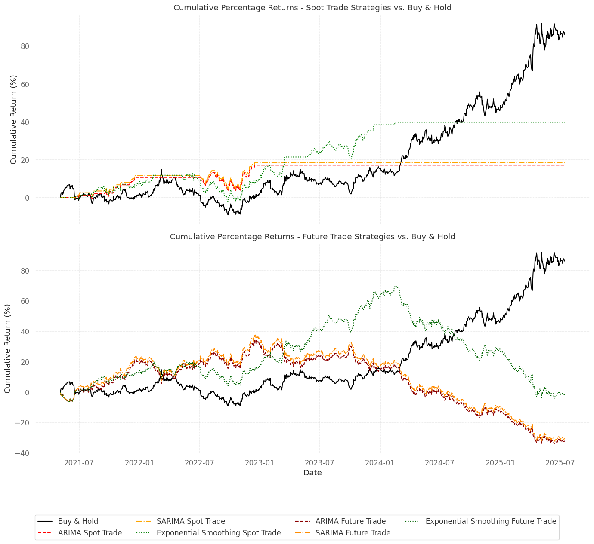

# Time Series Forecasting — XAUUSD 

## Overview

This project applies classical time series forecasting models to predict daily Gold (XAUUSD) prices.
Using a cleaned dataset of historical OHLCV data, it demonstrates an end-to-end workflow: from data preparation and stationarity testing to model selection, evaluation, and strategy backtesting.
The goal is to determine which forecasting model provides the most reliable signal for trading or risk management decisions.

## Methodology

- **Data Preparation** – Loaded and cleaned XAUUSD data (`XAU_1d_data.csv`), set time index, handled missing values.
- **Exploratory Analysis** – Visualized price trends and decomposed the series into trend, seasonal, and residual components.
- **Stationarity Testing** – Applied the Augmented Dickey-Fuller (ADF) test; differenced the series to achieve stationarity.
- **Model Implementation** – Built and compared ARIMA(1,1,0), SARIMA (seasonal period ≈25), and Holt’s Exponential Smoothing models.
- **Evaluation** – Measured performance with MSE, RMSE, MAE, and R²; visualized predicted vs. actual prices.
- **Backtesting** – Simulated spot and futures-style strategies based on model forecasts, using QuantStats for performance metrics.

## Results

The model has shown effectiveness in the short term, so it should be used to forecast daily to capture large volatility. 

## Skills Demonstrated

| Category             | Tools / Techniques          | Description                                    |
| -------------------- | --------------------------- | ---------------------------------------------- |
| Data Analysis        | Python, pandas, numpy       | Data cleaning, preprocessing, and manipulation |
| Time Series Modeling | statsmodels, sklearn        | ARIMA, SARIMA, Exponential Smoothing           |
| Diagnostics          | ADF Test, ACF/PACF          | Stationarity and autocorrelation analysis      |
| Evaluation           | sklearn.metrics, quantstats | Forecast accuracy and strategy performance     |
| Visualization        | matplotlib, seaborn         | Clear data storytelling for model comparison   |

## Value & Impact

This project demonstrates the practical use of econometric forecasting for financial assets—balancing academic rigor with trading application.
It highlights key skills in time-series modeling, performance evaluation, and financial analytics that are core to quantitative research and data-driven strategy development.

